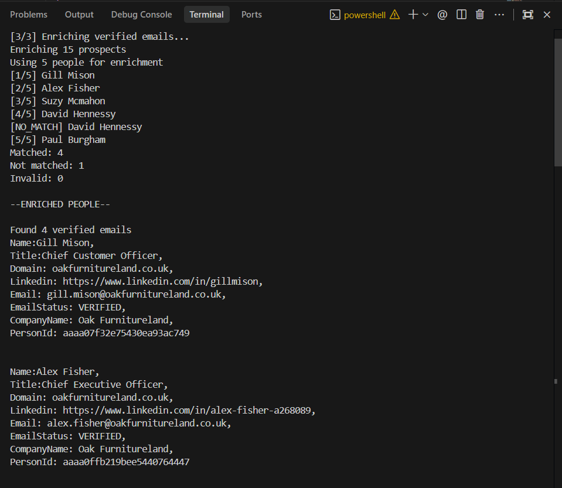
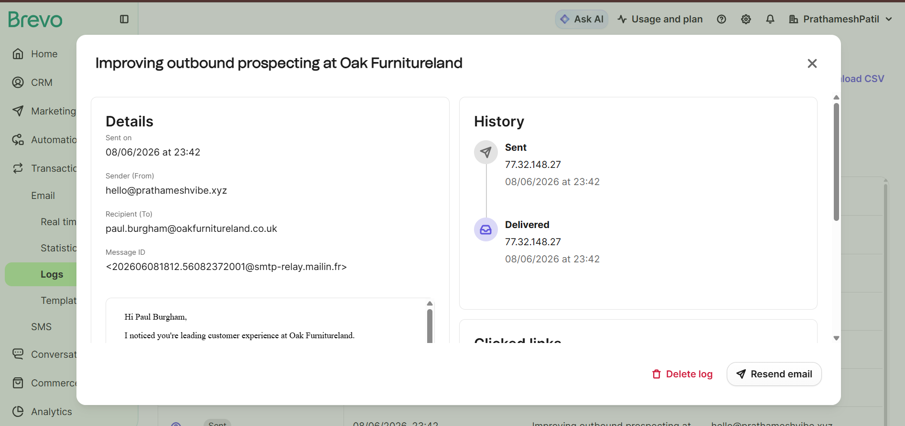

# Automated Outbound Outreach Pipeline

An end-to-end outbound prospecting pipeline built for the Vocallabs / Subspace SDE Internship Assessment.

The system accepts a seed company domain, discovers similar companies, identifies decision-makers, enriches verified contact information, and sends personalized outreach emails.

---

## Pipeline Flow

```text
Seed Domain
    ↓
Ocean.io
    ↓
Lookalike Companies
    ↓
Prospeo Search Person
    ↓
Decision Makers
    ↓
Prospeo Enrich Person
    ↓
Verified Emails
    ↓
Email Preview + User Confirmation
    ↓
Brevo
    ↓
Personalized Outreach Email
```

---

## Features

* Discover lookalike companies using Ocean.io
* Find decision-makers using Prospeo Search Person
* Enrich prospects with verified email addresses
* Preview emails before sending
* Require user confirmation before delivery
* Send personalized outreach emails through Brevo
* Handle rate limits and unmatched records gracefully

---

## Screenshots

### Pipeline Execution



### Email Preview



---

## Tech Stack

* Node.js
* Axios
* Ocean.io API
* Prospeo API
* Brevo API

---

## Project Structure

```text
.
├── screenshots/
│   ├── pipeline-run.png
│   └── email-preview.png
│
├── services/
│   ├── ocean.service.js
│   ├── prospeoSearch.service.js
│   ├── prospeoEnrich.service.js
│   └── brevo.service.js
│
├── main.js
├── pipeline.js
├── README.md
└── .env.example
```

---

## Environment Variables

Create a `.env` file:

```env
OCEAN_API_KEY=

PROSPEO_API_KEY=

BREVO_API_KEY=
BREVO_SENDER_NAME=
BREVO_SENDER_EMAIL=
```

---

## Installation

```bash
npm install
```

---

## Usage

Run the pipeline with a seed domain:

```bash
node main.js ikea.com
```

Example:

```bash
node main.js hubspot.com
```

---

## Example Output

```text
[1/3] Finding lookalike companies...
Found domains:
- oakfurnitureland.co.uk
- mobilia.ca
- kare-design.com

[2/3] Finding decision makers...
Found 15 decision makers

[3/3] Enriching verified emails...
Found 4 verified emails

Recipients:
1. Gill Mison <gill.mison@oakfurnitureland.co.uk>
2. Alex Fisher <alex.fisher@oakfurnitureland.co.uk>

Send 4 emails? (y/n)

🟢 Email queued for Gill Mison
🟢 Email queued for Alex Fisher

✅ Pipeline completed successfully
```

---

## Personalization

Each email is personalized using available prospect data:

* Name
* Job Title
* Company Name

Example:

```text
Hi Gill,

I noticed you're leading customer experience at Oak Furnitureland.

We recently built an outbound prospecting workflow that helps teams identify and reach highly relevant B2B prospects automatically.

Would you be open to a quick conversation this week?

Best regards,
Prathamesh
```

---

## Notes

* Only verified emails are used for outreach.
* Duplicate prospects are removed before enrichment.
* Unmatched prospects are skipped automatically.
* User confirmation is required before emails are sent.

---

## Assessment Outcome

Successfully implemented:

* Ocean.io Integration
* Prospeo Search Person Integration
* Prospeo Enrich Person Integration
* Brevo Email Delivery Integration
* Personalized Outreach Workflow
* End-to-End Automated Outbound Prospecting Pipeline
